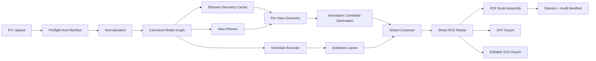

# IFC -> Architectural Drawing Book

Prepared: 2026-04-22  
Scope: research report for an open-source-core, server-side SaaS that ingests IFC and emits a publication-ready architectural drawing book.

## Executive Summary

This product is technically feasible, but only if the architecture treats it as three separate problems instead of one:

1. IFC normalization across authoring-tool dialects.
2. Exact 3D-to-2D geometry extraction for a narrow subset of drawing semantics.
3. Synthesis of drawing conventions that are only partly encoded in IFC.

The strongest open-source stack today is:

- `IfcOpenShell` for IFC parsing, schema access, relationships, and geometry setup. [S1][S2][S3]
- `OpenCascade` as the final exact geometry kernel for sections, silhouettes, and hidden-line extraction. [S6][S7][S8][S9][S10]
- `ezdxf` for DXF output, `SVG` as the editable intermediate, and either `WeasyPrint` or `ReportLab` for final PDF assembly. [S20][S23][S24]
- `qpdf` as a deterministic post-processor for final PDF normalization and merging. [S25]

The wrong architecture is “call IfcConvert/Bonsai/FreeCAD headlessly and hope the drawings are good enough.” Those projects are valuable reference implementations, but not the production hot path for this SaaS:

- `Bonsai` drawing docs are explicitly still work-in-progress, and the stack inherits GPL/Blender concerns. [S18][S19]
- `FreeCAD` can run headlessly, but headless mode has no GUI view providers, which matters for document-generation workflows built around desktop rendering abstractions. [S16][S17]
- `IfcOpenShell`’s own drawing initiative documents that the existing implementation was a hacky prototype and calls out the need for headless, semantic SVG, caching, multicore support, and IFC-native annotation persistence. [S4]

The single hardest technical problem is not “rendering IFC.” It is generating stable, clean 2D linework with correct drawing semantics:

- cut lines heavier than beyond lines,
- overhead elements shown by rule rather than pure geometry,
- symbolic content such as door swings and stair arrows,
- deduped, chained vectors suitable for dimensions and tagging.

Pure mesh slicing is too noisy for production drawings. Pure HLR is insufficient because it does not solve cut semantics. Pure sectioning is insufficient because it does not solve visible beyond-line extraction. The recommended path is a hybrid:

1. exact BRep sectioning for cut geometry,
2. exact or near-exact projected visible-line extraction for non-cut elements,
3. semantic overlays for symbols, tags, hatches, and conventions,
4. mesh only for preview or isolated fallback classes.

No original benchmark was run for this report. Any go/no-go decision for the geometry core should therefore be gated by a benchmark program on a realistic corpus before product commitment. This report includes the benchmark design and acceptance gates rather than invented results.

## Method And Confidence

- Sources were weighted toward official project documentation, official repositories, and official issue trackers.
- Where the evidence is a bug tracker or forum rather than formal docs, it is used to assess operational risk rather than product marketing claims.
- No original performance benchmark was run in this research phase.
- Licensing comments are engineering guidance, not legal advice.

## 1. Stack Evaluation

### 1.1 Summary Table

| Component | Capability fit | License | SaaS implication | Headless readiness | Maturity / health | Main limitations | Recommendation |
| --- | --- | --- | --- | --- | --- | --- | --- |
| IfcOpenShell | Best available OSS IFC parser + geometry bridge + IFC utilities | LGPL-3.0-or-later for core; some subprojects differ | Safe for closed SaaS if kept as library/service and LGPL obligations are respected on distribution | Strong; includes CLI and APIs | Very active repo, broad ecosystem, active releases [S1] | SVG/drawing path not production-grade by itself; IFC dialect variability; OCC-dependent | Use as the IFC front door and normalization backbone |
| OpenCascade (OCCT) | Exact BRep kernel, booleans, HLR, topology | LGPL-2.1 with additional exception | SaaS-friendly; proprietary apps explicitly allowed by FAQ [S7] | Strong for geometry algorithms | Mature industrial kernel [S6][S8] | HLR restrictions and open bugs; boolean/threading caveats | Use as the final geometry kernel |
| pythonOCC-core | Python wrapper for OCCT | LGPL-3.0 | SaaS-friendly; commercial embedding stated by project [S13][S14] | Good for server Python | Mature, active releases [S14] | Wrapper overhead, packaging complexity, API lag risk | Useful for Python-first geometry services or prototyping |
| Bonsai | Reference implementation for IFC-native drafting ideas | GPL-3.0-or-later | Avoid in production hot path if you want maximum licensing flexibility | Blender can run headless, but stack is desktop-centric | Active, but drawing docs are still WIP [S18][S19] | GPL, Blender dependency, incomplete drawings docs | Use as research input only |
| FreeCAD BIM | Useful laboratory for BIM/CAD experimentation | FreeCAD core LGPL-2.1; add-on licenses vary | Core is SaaS-friendly, but workbench licenses must be checked individually | Headless via `FreeCADCmd`, but headless lacks view providers [S17] | Large, healthy project [S16] | Not a natural stateless worker runtime; GUI abstractions leak | Research tool only |
| web-ifc | Fast IFC parsing in browser/Node/WASM; preview tier | MPL-2.0 | SaaS-friendly; file-level copyleft if distributed with modifications | Good for browser and Node | Active repo and releases [S15] | Not an exact BRep/2D drafting kernel | Use for preview or QA tools, not final drawings |
| ezdxf | DXF read/write/export adapter | MIT | Excellent for closed SaaS | Strong | Mature, actively maintained [S20] | No open-core DWG path; ODA bridge is proprietary [S20] | Use for DXF export only |
| svgwrite | Simple SVG emitter | MIT | Safe | Strong | Archived / unmaintained since 2024 [S21] | Unmaintained; write-only; limited long-term confidence | Avoid for new core work |
| CairoSVG | SVG -> PDF/PNG/PS converter | LGPLv3 | Acceptable in SaaS, but adds LGPLv3 to doc path | Strong | Mature utility [S22] | Converter, not layout engine; static focus only | Optional utility, not primary compositor |
| WeasyPrint | HTML/CSS paged PDF engine | BSD-3-Clause | Strong fit for closed SaaS | Strong | Very healthy project [S23] | Rendering changes across major releases; system-lib stack must be pinned [S23] | Strong option for sheet/book assembly |
| ReportLab | Low-level PDF generation | BSD | Strong fit for closed SaaS | Strong | Long production history [S24] | More manual layout burden; accessibility extras are commercial [S24] | Use when deterministic low-level control matters |
| qpdf | Deterministic PDF transform / merge / normalize | Apache-2.0 | Strong fit for closed SaaS | Strong | Mature | Not a layout engine | Add for final PDF normalization and assembly |

### 1.2 Detailed Notes

#### IfcOpenShell

`IfcOpenShell` is the current best open-source candidate for IFC ingestion because it combines:

- schema-aware parsing,
- relationship traversal,
- a mature Python/C++ API surface,
- IFC utilities such as `IfcPatch`, `IfcTester`, and conversion tools, and
- a native geometry iterator that can emit BRep-native geometry. [S1][S2][S3]

Important cautions:

- Do not mistake “can emit SVG” for “can generate a production drawing book.” The project’s own long-running drawing issue says the current implementation was a script experiment that is not fast or robust enough. [S4]
- There are still open SVG floor-plan correctness bugs, including door display on incorrect floors in recent versions. [S5]

Engineering conclusion:

- Use `IfcOpenShell` for ingest, normalization, relationship traversal, and geometry preparation.
- Do not use its stock SVG pathway as the final production renderer.

#### OpenCascade / OCCT

OCCT is the only candidate in this stack with the exact geometric capabilities needed for credible architectural linework:

- BRep topology,
- exact sectioning,
- exact hidden-line removal,
- edge/facing classification,
- shape healing and Boolean operations. [S8][S9][S10]

But its failure modes are exactly the sort that sink drawing automation projects:

- the HLR docs themselves distinguish exact `HLRBRep_Algo` from faster polygonal `HLRBRep_PolyAlgo`, and explicitly note that the poly variant returns polygonal segments; [S8]
- OCCT still has open HLR defects such as visible edges disappearing; [S11]
- sectioning and boolean operations have concurrency and mutability caveats, and older APIs are deprecated or marked obsolete; [S10][S12]
- HLR has explicit restrictions, including not processing points and infinite faces/lines. [S8]

Engineering conclusion:

- OCCT is still the right final kernel.
- It must run inside process-isolated workers.
- It must be wrapped with aggressive caching, retries only on transient worker crashes, and element-level fallback paths.

#### pythonOCC-core

`pythonOCC-core` exists in a useful middle ground:

- it gives Python orchestration direct access to OCCT,
- the project explicitly states LGPL licensing and commercial embedding support, and
- it targets desktop, web, and server usage. [S13][S14]

Engineering conclusion:

- Good for a Python-first implementation and early benchmark harnesses.
- Long term, keep the heaviest geometry loops either inside native extensions or a narrow service boundary so you are not hostage to Python wrapper overhead.

#### Bonsai

`Bonsai` matters because it proves there is real demand for IFC-native drawings and because it contains hard-won domain knowledge. The problem is product fit:

- it is GPL-3.0-or-later inside the IfcOpenShell tree; [S1]
- its drawing documentation is still marked incomplete and work-in-progress; [S19]
- it assumes Blender-centric workflows and mentions Inkscape in its drawing guidance. [S19]

Engineering conclusion:

- Study it.
- Reuse concepts.
- Keep it out of the production SaaS hot path.

#### FreeCAD BIM

`FreeCAD` is attractive because the core license is weak-copyleft and the project is healthy. [S16] It is also one of the few open-source CAD/BIM platforms with a real headless story. However:

- the documented headless path is `FreeCADCmd`; [S17]
- headless mode cannot access GUI view providers, which limits direct reuse of desktop document-generation abstractions. [S17]

Engineering conclusion:

- Good for experiments, geometric comparison, and migration tests.
- Not the primary production runtime.

#### web-ifc

`web-ifc` is materially useful, but mostly for the wrong layer:

- it is fast,
- it works in browser and Node,
- it is available under MPL-2.0,
- and it can also be used as stand-alone C++ according to the repo. [S15]

Its problem is not licensing. It is representation fidelity. The library is centered on parsing and WASM delivery, not exact architectural 2D drafting semantics.

Engineering conclusion:

- Use it for browser-side preview, preflight inspection, or customer review tools.
- Do not make it the final drawing engine.

#### ezdxf

`ezdxf` is the right open-core DXF adapter:

- MIT license,
- broad DXF version coverage,
- ability to preserve unknown third-party tags,
- optional C-extensions,
- and clear export tooling. [S20]

Its repo also documents that DWG integration relies on an interface to the proprietary ODA File Converter. [S20]

Engineering conclusion:

- DXF yes.
- DWG in the open-source core no.

#### svgwrite

`svgwrite` has a permissive license, but the repo is archived and explicitly calls itself inactive. [S21]

Engineering conclusion:

- Do not build a strategic renderer around it.
- Either emit SVG directly from your own serializer or use a maintained SVG writer.

#### CairoSVG

`CairoSVG` is a solid converter:

- LGPLv3,
- command-line and Python use,
- PDF/PNG/PS output,
- W3C SVG-sample testing. [S22]

Engineering conclusion:

- Useful as a conversion utility.
- Not a substitute for sheet layout or PDF book assembly.

#### WeasyPrint

`WeasyPrint` is the strongest document-assembly candidate if you want HTML/CSS paged media:

- BSD license,
- active project,
- explicit print-focused rendering model,
- support for paged document features. [S23]

Important caution:

- the project’s API docs explicitly warn that new versions can change rendering, even when the API is stable. [S23]

Engineering conclusion:

- Good for title blocks, cover sheets, indexes, legends, schedules, running headers, page numbers, and final book assembly.
- Pin versions aggressively and regression-test all upgrades.

#### ReportLab

`ReportLab` remains the best low-level PDF fallback:

- BSD license,
- strong commercial-use language,
- runs anywhere Python runs,
- long production history. [S24]

Its tradeoff is authoring ergonomics:

- if you want sophisticated paged layout, you will build more by hand than with `WeasyPrint`;
- some advanced accessibility features are only in the commercial offering. [S24]

Engineering conclusion:

- Keep it for deterministic low-level PDF control, custom graphics, barcodes, or as a fallback when HTML/CSS layout becomes too indirect.

### 1.3 Additional Components Missing From The Initial List

These are not optional “nice to haves”; they close real product gaps.

| Component | Why it matters | Likely role |
| --- | --- | --- |
| `IfcTester` / IDS validation | Lets you enforce supported IFC authoring profiles at ingest time instead of failing deep inside geometry | Preflight validation |
| `IfcPatch` | Gives a starting point for repeatable IFC repair and normalization recipes | Normalization |
| `qpdf` | Useful for deterministic PDF merges, metadata cleanup, and final normalization | Book assembly |
| A 2D topology library such as `Shapely` | Needed for room polygons, collision checks, hatch clipping, label placement, and dimension chain routing | Annotation/layout |
| A deterministic solver layer | Needed for tag placement and collision resolution; implementable with ILP/CP-SAT or a custom search | Annotation/layout |

## 2. Proposed Pipeline Architecture

### 2.1 End-to-End Flow



### 2.2 Stage Boundaries

#### Stage A: Preflight And Manifest

Input:

- raw IFC file,
- tenant/project metadata,
- requested style profile,
- requested output package.

Output:

- immutable job manifest,
- raw-object checksum,
- schema/version detection,
- early validation report,
- routing decision into worker class.

Why this boundary exists:

- It is the right place to reject impossible jobs before paying the geometry cost.
- It creates the canonical hash root for every downstream cache key.

Failure modes:

- unsupported schema,
- file too large for current worker class,
- invalid text encoding,
- missing units or totally broken header,
- unsupported authoring profile.

Caching:

- raw file hash,
- preflight result keyed by raw file hash.

#### Stage B: Normalization

Input:

- raw IFC,
- normalization profile,
- supported authoring-tool profile.

Output:

- canonical internal model graph,
- normalized units,
- normalized placements/origin,
- inferred storeys/spaces where allowed,
- flattened type/property inheritance,
- issue ledger with severity.

Why this boundary exists:

- Everything downstream must stop caring whether the model came from Revit, ArchiCAD, Allplan, or Tekla.
- Geometry generation and annotation logic should only read the canonical graph.

Failure modes:

- too many unclassified primary elements,
- irrecoverable placement graph errors,
- no usable building/storey structure,
- missing required relationships for supported MVP outputs.

Caching:

- canonical normalized graph keyed by `raw_ifc_hash + normalizer_version + support_profile_version`.

Parallelism:

- mostly single-job, single-process.
- Some element-level normalization can parallelize, but keep the graph assembly deterministic and serial at the end.

#### Stage C: View Planning

Input:

- canonical model graph,
- style profile,
- output package request.

Output:

- view manifest:
  - storeys to draw,
  - cut plane(s),
  - depth bands,
  - view extents,
  - included classes,
  - sheet assignments,
  - schedule definitions,
  - cross-reference graph.

Why this boundary exists:

- Drawing generation is expensive. Decide exactly which views exist before generating geometry.
- Cross-sheet references and book order must be frozen before annotation symbols are resolved.

Failure modes:

- no valid storey extents,
- cyclic sheet references created by template rules,
- unsupported requested view type for available semantics.

Caching:

- view manifest keyed by `normalized_model_hash + style_profile_hash + package_request_hash`.

#### Stage D: Element Geometry Cache

Input:

- canonical model graph,
- geometry backend version,
- element filter from view manifest.

Output:

- exact BRep or accepted fallback geometry blobs per element,
- stable per-element geometry digest,
- bbox, elevation band, and topology summary.

Why this boundary exists:

- Geometry creation is expensive and reusable across many views.
- It is the natural content-addressable cache boundary for incremental regeneration.

Failure modes:

- invalid or non-manifold solids,
- unsupported representation item,
- geometry kernel crash,
- pathological memory growth.

Caching:

- keyed by `element_geom_digest + geometry_backend_version + geometry_settings_hash`.

Parallelism:

- parallel per element or per element batch.
- Use process pools, not threads, for safety and containment.

#### Stage E: Per-View Geometry

Input:

- view manifest item,
- geometry cache,
- style profile.

Output:

- classified vector primitives by view:
  - cut,
  - visible projection,
  - overhead/beyond,
  - hidden if requested,
  - hatch seeds,
  - semantic anchors.

Why this boundary exists:

- This is the expensive, view-specific stage that should fan out horizontally.

Failure modes:

- boolean/HLR failure on one element,
- duplicate or fragmented edges,
- unstable classification near cut plane tolerance,
- exploding complexity from furniture/MEP clutter.

Caching:

- keyed by `view_hash + element_geom_digest_set + style_profile_hash + geometry_backend_version`.

Parallelism:

- parallel per view, and within a view per element-class batch.

#### Stage F: Annotation And Layout

Input:

- per-view vector graph,
- canonical model graph,
- style profile,
- schedule data.

Output:

- placed dimensions,
- tags,
- labels,
- symbols,
- sheet blocks,
- schedule tables.

Why this boundary exists:

- Annotation logic is mostly 2D and semantic, not 3D.
- It can be tuned and tested separately from the geometry kernel.

Failure modes:

- collision deadlocks,
- missing anchor semantics,
- incorrect text metrics,
- unstable layout because font environment changed.

Caching:

- keyed by `view_vector_hash + style_profile_hash + font_pack_hash + annotation_engine_version`.

#### Stage G: Sheet Composition And Book Assembly

Input:

- placed sheet content,
- sheet templates,
- document metadata.

Output:

- sheet SVG masters,
- PDF book,
- DXF exports,
- audit manifest with hashes.

Why this boundary exists:

- SVG is the cleanest editable master.
- PDF/DXF are derivative outputs and should never be the first internal representation.

Failure modes:

- font substitution,
- PDF metadata nondeterminism,
- reference numbering drift,
- layer-name mismatches in DXF.

Caching:

- sheet SVG keyed by `sheet_hash`;
- final book keyed by ordered list of `sheet_hash` values plus output profile.

### 2.3 Why These Boundaries Are Correct

They align with the dominant cost and failure surfaces:

- normalization failures are semantic and authoring-tool specific,
- geometry failures are OCCT- and model-quality specific,
- annotation failures are 2D combinatorial problems,
- final composition failures are document-engine and font-environment problems.

That separation is what makes horizontal scaling, observability, and deterministic re-runs practical.

## 3. The Geometry Core

### 3.1 What “Correct” Means For Architectural Drawings

The geometry engine is not “correct” when it produces mathematically exact projection. It is correct when it produces linework that matches drawing convention:

- section-cut elements are heavy,
- beyond elements are lighter,
- overhead elements may be dashed or suppressed by height rule,
- hidden lines are often suppressed entirely in architectural GA drawings,
- symbolic overlays such as door swings are rule-driven, not inferred from HLR.

That means the geometry core must output classified primitives, not a flat soup of segments.

### 3.2 Approach Comparison

| Approach | Quality | Performance | Determinism | Main failure mode | Verdict |
| --- | --- | --- | --- | --- | --- |
| `HLRBRep_Algo` only | Exact projected edges and silhouettes | Moderate to slow | Potentially good if isolated and sorted | Does not solve cut semantics; known open HLR defects [S11] | Necessary but not sufficient |
| `HLRBRep_PolyAlgo` only | Faster, polygonal | Faster | Good | Polygonal output by design [S8] | Preview only |
| `BRepAlgoAPI_Section` only | Exact cut edges | Moderate | Good if inputs copied and outputs sorted | Does not generate visible beyond-linework; edge ordering/boolean quirks [S10][S12] | Necessary but not sufficient |
| Mesh slicing / mesh HLR | Fast | Fastest | Tolerance-sensitive | Stair-stepped arcs, duplicate noise, poor dimensions | Preview or fallback only |
| Hybrid exact section + exact projection + semantic overlays | Highest | Moderate if aggressively culled and cached | Best achievable | More implementation complexity | Recommended |

### 3.3 Recommended Hybrid Strategy

#### Final pipeline for plan views

1. Build exact geometry only for classes that materially affect the plan:
   - walls,
   - slabs,
   - columns,
   - beams if in scope,
   - stairs,
   - railings if shown,
   - windows and doors as openings/infill,
   - structural framing for supported profiles.
2. Spatially cull by storey, bbox, and view slab before exact geometry work.
3. Compute cut geometry by intersecting solids with the section plane or cut slab.
4. Compute visible projected linework for non-cut included elements using exact HLR where needed.
5. Apply semantic rules to classify overhead content by elevation bands rather than full hidden-line reasoning wherever convention allows it.
6. Post-process:
   - weld coincident edges,
   - chain collinear segments,
   - preserve analytic arcs wherever possible,
   - remove duplicates with tolerance tied to output scale.
7. Hand the vector graph to the annotation engine, not directly to the renderer.

#### Why pure HLR is not enough

OCCT’s HLR system is about visible/hidden edges of existing geometry. It does not decide which edges should become “cut” edges in an architectural sectioned plan. You still need explicit sectioning and semantic elevation rules. [S8][S9]

#### Why pure sectioning is not enough

Plane-section results give you intersection curves, but not all the visible outlines of doors, windows, fixtures, stairs, or façades that should appear beyond the cut.

#### Why mesh is not enough

Architectural drawings care about:

- arcs staying arcs,
- consistent line joins,
- clean hatches,
- stable dimension anchors.

Mesh pipelines create tolerance noise that directly degrades annotation quality.

### 3.4 Known OCCT Risk Surface

The evidence base here is strong enough to treat these as design facts, not edge cases:

- OCCT documents exact and polygonal HLR as distinct algorithms with different accuracy/performance tradeoffs. [S8]
- OCCT HLR still has open correctness bugs such as incorrectly hidden visible edges. [S11]
- `BRepAlgoAPI_Section` convenience constructors are marked obsolete in the class reference. [S10]
- OCCT maintainers explicitly warn that sectioning may modify input shapes unless non-destructive behavior is enabled, and concurrency around shared shapes is unsafe. [S12]

Engineering consequences:

- no shared mutable shapes across workers,
- deep-copy or rebuild per task boundary,
- process isolation,
- deterministic sorting and tolerance normalization after every OCCT stage,
- fallback path for per-element failure instead of whole-view abort.

### 3.5 Benchmark Status

No original benchmark was run for this report.

### 3.6 Benchmark Program That Must Be Run Before Product Commitment

Corpus:

- 5 to 10 IFCs,
- at least one each from Revit, ArchiCAD, Allplan, Tekla, and Bonsai/IfcOpenShell samples,
- include one small, one medium, and one large architectural model,
- include one intentionally dirty model with proxies and broken spaces.

Views:

- floor plan per storey,
- one building section,
- one elevation.

Backends to compare:

1. exact section + exact HLR,
2. exact section + polygonal HLR,
3. mesh slice + mesh outline,
4. hybrid with semantic suppression of hidden lines.

Metrics:

- wall-clock time per stage,
- peak RSS,
- crash rate,
- per-view determinism hash over repeated runs,
- duplicate-edge ratio,
- arc-preservation ratio,
- number of manual redline issues from an architect reviewer,
- percent of dimensions anchored to stable geometry without manual fix.

Suggested acceptance gates:

- zero worker crashes on the corpus in three repeated runs,
- byte-identical outputs across repeated runs with same environment,
- no major architectural redline defects on the supported MVP scope,
- exact pipeline affordable enough to process the target corpus inside your target SLA.

Do not move from research to product architecture until this benchmark exists.

## 4. The Synthesis Problem

### 4.1 Why IFC Alone Is Not Enough

A publishable drawing book contains information that is often absent, partial, or too tool-specific in IFC:

- door swings,
- stair direction arrows,
- section and elevation marks,
- dimension chains,
- room tags,
- hatch conventions,
- line weight hierarchy,
- title blocks and sheet references.

The system therefore needs a synthesis layer that is architectural, not cosmetic.

### 4.2 Style Profiles Must Control Interpretation, Not Just Appearance

A style profile should govern:

- which elements are shown in each view type,
- cut-plane height and depth rules,
- class-to-lineweight mapping,
- hatch rules by material/class/context,
- symbol families and text templates,
- dimensioning rules,
- schedule schemas,
- sheet templates,
- language, units, rounding, and notation,
- reference-mark graphics and numbering.

If these rules live as hardcoded branches in application code, the product will lock itself into one office standard and become unmaintainable.

### 4.3 Proposed Style-Profile Architecture

Use a versioned, declarative profile stack:

1. `base_standard`
   - example: `iso_metric_v1`, `din_de_v1`
2. `discipline_overlay`
   - example: `architectural_ga_plan_v1`
3. `office_overlay`
   - customer office conventions
4. `project_override`
   - project-specific deviations

Suggested profile modules:

- `geometry_rules`
- `classification_rules`
- `graphics_rules`
- `symbol_rules`
- `dimension_rules`
- `tag_rules`
- `schedule_rules`
- `sheet_rules`
- `validation_rules`

Example skeleton:

```yaml
profile_id: din_arch_ga_plan_v1
inherits: iso_metric_v1
view_types:
  floor_plan:
    cut_plane_m: 1.10
    view_depth_below_m: 0.20
    overhead_depth_above_m: 2.30
    include_classes:
      - IfcWall
      - IfcSlab
      - IfcColumn
      - IfcDoor
      - IfcWindow
      - IfcStair
graphics:
  lineweights_mm:
    cut_primary: 0.35
    cut_secondary: 0.25
    projected: 0.18
    overhead: 0.13
  linetypes:
    overhead: dashed
symbols:
  door_swing:
    source: derived
  stair_arrow:
    source: derived
annotation:
  room_tag:
    template: "{name}\\n{number}\\n{area_m2:.1f} m2"
dimensions:
  exterior_chain_order:
    - openings
    - grid
    - overall
```

### 4.4 How To Synthesize Missing Information

| Missing drawing content | Primary source | Fallback / synthesis |
| --- | --- | --- |
| Door swing | `IfcDoor` operation type, opening relationship, local placement | derive symbolic swing from handedness and opening width; omit if ambiguous |
| Stair up-arrow | stair decomposition, riser path, elevation direction | derive from stair axis and level change |
| Room tag | `IfcSpace` name/number/area | derive provisional room polygon only in supported MVP cases |
| Section marks | view graph and sheet references | generated entirely by drawing system |
| Dimension chains | geometry graph + office rules | generated entirely by drawing system |
| Hatches | material/class/context | default by class when material data is weak |
| Line weights | style profile | never hardcoded in geometry code |

This is why the style system belongs above geometry but below rendering.

## 5. Annotation And Layout

### 5.1 Survey

| Approach | Strengths | Weaknesses | Fit |
| --- | --- | --- | --- |
| Pure rule-based | Deterministic, easy to audit, cheap | Brittle in dense drawings | Good baseline |
| Force-directed | Good local decluttering | Harder to make globally deterministic and convention-aware | Useful as local refinement |
| Constraint solver | Best global optimization, collision-free layouts, deterministic when ordered | More implementation effort | Best long-term choice |
| ML-based | Can imitate human placement | Needs labeled data, hard to debug, weak determinism story | Not for MVP |

### 5.2 Recommendation

Use a deterministic hybrid:

1. rule-based candidate generation,
2. discrete candidate scoring,
3. constraint or assignment solve per local zone,
4. deterministic local nudging if needed.

This keeps the system:

- explainable,
- office-standard aware,
- testable,
- deterministic.

### 5.3 Dimension Strategy

Recommended MVP dimension scope:

- exterior overall dimensions,
- opening-chain dimensions on primary façades or corridor walls,
- selected room dimensions only where topology is very stable.

Do not attempt full human-like interior dimensioning in MVP. It is expensive, error-prone, and often office-specific.

Dimension pipeline:

1. detect dimension baselines from outer wall loops or grids,
2. extract anchor points from openings/intersections,
3. cluster anchors into chains,
4. rank candidate chains by office rules,
5. solve for placement with no collision against text, tags, and symbols.

### 5.4 Tag Placement

Recommended tag-placement algorithm:

1. stable anchor generation from element centroid / semantic anchor,
2. finite candidate positions around anchor,
3. score:
   - overlap penalty,
   - leader length,
   - crossing count,
   - orientation penalty,
   - zone priority,
4. solve assignment per region,
5. freeze order and serialization to preserve determinism.

Critical implementation detail:

- text measurement must come from the same font engine and font files used in final rendering, otherwise placement and final output will diverge.

## 6. IFC Quality And Normalization

### 6.1 Canonical Normalization Layer

The normalizer should emit a canonical internal model with:

- stable element IDs,
- resolved placement transforms in project-local coordinates,
- canonical storeys and elevations,
- canonical spaces,
- flattened property bag per element,
- inferred semantic class when allowed,
- geometry-relevant summaries,
- validation issues.

### 6.2 Detect / Fix / Reject Matrix

| Problem | Detect | Fix | Reject when |
| --- | --- | --- | --- |
| Missing / inconsistent units | header + unit assignments | canonicalize to metric internal units | length units cannot be resolved |
| Huge world coordinates / false origin | placement graph + bbox magnitude | shift to local engineering origin, preserve reversible transform | transforms are inconsistent or overflow tolerances |
| Missing storey elevations | spatial tree + Z clustering + slabs | infer from slab tops / element clusters | no stable vertical partition exists |
| Missing `IfcSpace` | count spaces and room-bounding semantics | derive provisional spaces only in supported MVP profile | room-based outputs required but derivation confidence is low |
| `IfcBuildingElementProxy` overuse | entity class scan + names / types / psets | map via heuristics to supported class family | primary building fabric remains too ambiguous |
| Broken or inconsistent PSets | schema-aware parse + known pset aliases | canonicalize keys, keep raw copies | required data fields for requested outputs stay missing |
| Missing door/window relationships | relationship scan | infer from openings and placement when possible | openings and infill cannot be resolved |
| Invalid solids | geometry health pass | heal, rebuild, or downgrade to mesh fallback for non-critical classes | critical supported classes have no usable geometry |
| Missing storey containment | spatial relationships | infer from placement and elevation bands | elements cannot be assigned to supported views safely |

### 6.3 Specific Strategies Requested

#### No `IfcSpace`

- For MVP, do not promise room tags or room schedules unless either:
  - `IfcSpace` is present and sane, or
  - your supported authoring profile has a highly reliable derived-space path.
- Deriving spaces from wall loops is possible, but only on a narrow architectural subset.

#### Missing storey elevations

- Infer from `IfcBuildingStorey` placement if present.
- Fallback to slab/level clustering.
- Keep the inferred result explicit in the issue ledger; never silently treat it as authoritative.

#### `IfcBuildingElementProxy`

- Create a mapping layer using:
  - type name,
  - object type,
  - property signatures,
  - material/profile hints,
  - geometry heuristics.
- Use this only for supported office-specific profiles.
- For unsupported proxies, classify as generic and exclude from dimension-critical logic.

#### Broken PSets

- Preserve raw pset payload separately.
- Build a canonical property dictionary with alias maps and precedence rules.
- Never let downstream code read raw tool-specific property names directly.

## 7. SaaS-Specific Concerns

### 7.1 Job Architecture

Recommended worker split:

- `preflight-worker`
- `normalize-worker`
- `geometry-worker`
- `annotation-worker`
- `compose-worker`

Use processes, not threads, for geometry-heavy stages because:

- OCCT sectioning has thread-safety caveats, [S12]
- Python adds GIL overhead,
- process isolation contains native crashes better.

Suggested execution model:

- one geometry job per process,
- bounded worker pool by memory tier,
- queue-backed orchestration,
- all artifacts stored in object storage,
- idempotent stage transitions through content hashes.

Retry strategy:

- retry transient infrastructure failures,
- retry one-time native worker crash by respawning a fresh process,
- do not blindly retry deterministic geometry errors more than once,
- quarantine and label models with recurring kernel failures.

### 7.2 Large IFC Handling

Principles:

- never reparse raw IFC if the normalized graph already exists,
- aggressively cull by storey and class before exact geometry,
- persist geometry cache artifacts out-of-process,
- maintain separate worker classes for large models.

Capacity assumptions for design planning, not measured benchmarks:

| Worker tier | Suggested use | Planning memory |
| --- | --- | --- |
| Small | preflight, compose, small residential | 8 GB |
| Medium | typical architectural plans | 16 GB |
| Large | heavy federated or high-detail geometry | 32-64 GB |

Do not convert these assumptions into product SLAs until benchmarked.

### 7.3 Multi-Tenancy, Security, GDPR

EU-first baseline:

- EU-region object storage and compute only,
- encryption in transit and at rest,
- per-tenant logical isolation,
- short-lived signed URLs for artifact delivery,
- strict retention policies,
- deletion workflow that removes raw, normalized, cached, and delivered artifacts,
- no use of customer models for training without explicit opt-in.

Logs must avoid leaking customer text content unnecessarily. Prefer:

- hashes,
- GlobalIds,
- sheet IDs,
- stage names,
- error codes.

### 7.4 Observability

Every log line in the processing path should carry:

- `job_id`
- `tenant_id`
- `model_hash`
- `stage`
- `element_global_id` where relevant
- `view_id`
- `sheet_id`
- `style_profile_hash`
- `backend_version`

This is necessary for triaging “door on wrong floor” or “dimension missing on sheet A-102” without replaying the entire job blindly.

### 7.5 Determinism

Same IFC + same profile must produce byte-identical output.

That requires:

- pinned dependency versions,
- pinned font pack,
- stable locale and timezone,
- deterministic sorting of elements, views, and sheets,
- seeded any-time heuristics,
- consistent float quantization before serialization,
- stable SVG attribute ordering,
- PDF metadata scrubbing and normalization,
- no wall-clock timestamps inside deliverables.

Use `qpdf` or equivalent as a final normalization step if the PDF engine emits variable identifiers or metadata. [S25]

### 7.6 Incremental Regeneration

Recommended cache keys:

- `raw_ifc_hash`
- `normalized_model_hash`
- `element_semantic_hash`
- `element_geometry_hash`
- `view_hash`
- `sheet_hash`
- `book_hash`

Regeneration rules:

- if only the style profile changes, reuse normalization and possibly geometry,
- if only annotation rules change, reuse per-view geometry,
- if only sheet template changes, reuse annotated view content,
- if only one element geometry hash changes, invalidate only views that reference it.

### 7.7 Cost Model

No measured compute cost is available from this research alone.

Use this calibration model after benchmarking:

`book_cost = parse + normalize + sum(unique elements needing exact geom) + sum(views exact projection) + annotation solve + sheet compose + pdf normalize`

The dominant cost drivers are almost certainly:

- exact geometry creation,
- sectioning,
- projected line extraction,
- annotation solve in dense drawings,
- not PDF composition.

Commercial pricing should therefore align to:

- model size,
- number of generated views,
- geometry complexity of supported classes,
- not raw IFC file size alone.

## 8. Licensing Matrix

Not legal advice. This is an engineering licensing matrix for a closed-source SaaS with an open-source core preference.

| Dependency | License | Closed SaaS implication | Main trap | Recommended stance |
| --- | --- | --- | --- | --- |
| IfcOpenShell core | LGPL-3.0-or-later [S1] | Generally acceptable in SaaS | distributing modified library versions or bundled binaries without compliance | Use via wrapper/service; upstream patches where feasible |
| IfcConvert | LGPL-3.0-or-later [S1] | Acceptable, but do not treat output as product-quality drawings | operational correctness, not license, is the bigger issue | Do not make it final renderer |
| Bonsai | GPL-3.0-or-later [S1] | Avoid in hot path if you want long-term flexibility and optional distribution paths | GPL contamination if distributed/integrated too tightly | Keep out of production core |
| OCCT | LGPL-2.1 + exception [S6] | Explicitly usable in proprietary products [S7] | compliance on distribution and third-party notices | Safe core dependency |
| pythonOCC-core | LGPL-3.0 [S14] | Acceptable in SaaS | same as LGPL above | Safe if wrapped cleanly |
| FreeCAD core | LGPL-2.1 [S16] | Acceptable in SaaS | add-on/workbench licenses vary | Use only for research unless every add-on license is reviewed |
| web-ifc | MPL-2.0 [S15] | Acceptable in SaaS | modified MPL-covered files must remain MPL if distributed | Fine for preview tier |
| ezdxf | MIT [S20] | Ideal | none material | Safe |
| svgwrite | MIT [S21] | Safe | maintenance risk, not licensing | Avoid for maintenance reasons |
| CairoSVG | LGPLv3 [S22] | Acceptable in SaaS | distribution obligations if you ship it on-prem | Optional utility only |
| WeasyPrint | BSD-3-Clause [S23] | Ideal at app level | remember system-lib notices | Strong choice |
| ReportLab | BSD [S24] | Ideal | avoid GPL add-ons such as pyRXP in closed bundles [S24] | Strong choice |
| qpdf | Apache-2.0 [S25] | Ideal | none material | Strong choice |

### 8.1 GPL / AGPL Traps

- `Bonsai` is GPL. [S1]
- Blender-based server automation inherits the GPL conversation even if pure SaaS network use may avoid distribution-triggered obligations. It is still the wrong strategic dependency for an “open-source core, licensing-flexible” SaaS.
- Avoid AGPL entirely in the hot path.
- Avoid GPL-only DWG libraries in the core path.

### 8.2 Modification Strategy

Recommended policy:

- wrap LGPL/MPL libraries,
- do not fork them casually,
- upstream bug fixes where practical,
- if you must patch, isolate the patch set and be prepared to publish required modifications where the relevant license requires it on distribution,
- keep your business logic in separate services and adapters, not inside vendor forks.

## 9. Output Formats And Round-Trip

### 9.1 Internal Master Format

Use `SVG` as the editable internal sheet master.

Reasons:

- vector-native,
- human-inspectable,
- easy to diff,
- easy to embed metadata such as `data-globalid`,
- convertible to PDF,
- more editable than PDF,
- easier to map to DXF layers than HTML.

### 9.2 PDF

PDF is the primary customer deliverable.

Recommendations:

- embed fonts,
- create bookmarks/outlines,
- remove variable timestamps and identifiers,
- attach an audit manifest if needed,
- consider PDF/A later, but do not let conformance work block MVP.

### 9.3 DXF / DWG

Recommendations:

- ship DXF export in the open-source core,
- do not promise DWG in the core MVP.

Reason:

- `ezdxf` is suitable for DXF, [S20]
- its documented DWG path depends on proprietary ODA conversion, [S20]
- true open-core DWG is still strategically awkward.

### 9.4 User Wants To Tweak The Drawing

This is an unsolved product problem if you treat the generated sheet as an opaque PDF.

Recommended strategy:

1. Generated base layer:
   - fully reproducible from IFC + profile.
2. Persistent overlay layer:
   - user annotations, manual tags, manual text, manual dimensions, redlines.
3. Re-apply overlays on regeneration:
   - anchor by stable view ID and semantic target IDs.

Persistence options:

- internal overlay JSON model keyed to sheet/view/anchor,
- exported SVG overlay,
- best-effort `IfcAnnotation` export for interoperability,
- DXF overlay layers for CAD consumers.

Recommendation:

- do not make `IfcAnnotation` your only persistence mechanism in MVP.
- Use it as an exchange/export path, not the system of record.

## 10. Validation Strategy

### 10.1 Reference Corpus

Build a corpus of 5 to 10 IFCs with:

- Revit,
- ArchiCAD,
- Allplan,
- Tekla,
- at least one public IfcOpenShell sample model. [S1]

Prefer:

- one small clean model,
- one medium mixed-quality model,
- one large realistic production model,
- one intentionally dirty model with proxies and missing spaces.

### 10.2 Expected Outputs

For each corpus file, define:

- supported views,
- expected inclusion/exclusion rules,
- hand-verified redline set,
- expected schedule columns,
- expected sheet order.

Do not try to define every line as “ground truth.” Instead validate at three levels:

1. semantic correctness,
2. visual acceptability,
3. deterministic reproducibility.

### 10.3 Automated Tests

- normalization assertions,
- geometry invariants,
- SVG structural diff,
- rasterized visual regression,
- repeated-run hash equality,
- PDF metadata equality,
- schedule row/value checks.

### 10.4 Human-In-The-Loop QA

Required workflow:

- architect reviews first outputs,
- redlines are categorized by:
  - geometry,
  - convention,
  - annotation,
  - data quality,
- every redline is traced back to:
  - IFC issue,
  - style profile gap,
  - geometry engine defect,
  - annotation engine defect.

Without this taxonomy, month six turns into endless subjective PDF feedback.

## 11. Hidden Stones

These are the non-obvious failure points likely to appear after initial demos succeed.

1. Exact geometry that is mathematically correct can still be drawing-wrong because architectural conventions suppress many hidden lines and add symbolic content.
2. Door swings are usually synthesized, not reliably present as ready-to-plot geometry.
3. Stair arrows depend on decomposition and direction semantics that are often incomplete.
4. Very large coordinates and false origins can destabilize booleans and sectioning.
5. Duplicate lines come from both geometry and post-processing; they destroy dimensions and make drawings look amateur.
6. Arc degradation to polyline fragments cascades into poor hatching, poor labeling, and unstable dimensions.
7. Storey containment is often weaker than teams assume; vertical clustering becomes part of normalization.
8. `IfcBuildingElementProxy` can quietly dominate real-world exports.
9. Type-level properties and occurrence-level properties are often inconsistent, and schedule correctness depends on precedence rules.
10. Section/elevation marks create cyclic dependencies across sheets; references must be frozen before final composition.
11. Font substitution or changed font packages will change pagination and break byte-identical output.
12. PDF metadata, object IDs, and timestamps will quietly break determinism unless normalized.
13. Parallel geometry can produce nondeterministic ordering even when the drawing looks identical.
14. HLR bugs do not show up on toy models; they appear on edge cases in real projects. [S11]
15. OCCT sectioning around shared shapes can create concurrency crashes or mutation issues if isolation is weak. [S12]
16. Furniture, entourage, and MEP geometry can dominate runtime while contributing little value to an architectural GA plan.
17. Reflected ceiling plans are a different product because they require ceiling/MEP semantics and different visibility rules.
18. “Editable output” becomes a product of its own unless overlays are designed from day one.
19. Schedule generation is mostly a semantic normalization problem, not a PDF problem.
20. DWG requests will arrive quickly; if you do not set scope early, licensing and interoperability pressure will distort the roadmap.

## 12. MVP Scope Recommendation

### 12.1 Recommended MVP

Build:

- architectural general floor plans only,
- one plan per storey,
- cover sheet,
- drawing index,
- simple room schedule and door schedule only when the IFC passes the supported profile checks.

Support only:

- one authoring source profile: Revit-exported architectural IFC,
- one regional convention: DIN / ISO metric office standard,
- one discipline: architecture,
- one building at a time,
- one style family.

### 12.2 Why This Is The Defensible Slice

Commercially:

- floor plans are high-frequency deliverables,
- repeated-storey buildings create visible automation value,
- cover/index/schedules make the output feel like a real drawing package.

Technically:

- plans avoid the hardest elevation/section linework in MVP,
- plan-view symbolism is more ruleable than full building sections,
- Revit is commercially important enough to justify a dedicated normalization profile,
- DIN/ISO metric aligns with an EU-first product stance and avoids dual-unit complexity.

### 12.3 What To Exclude From MVP

- sections and elevations as contractual deliverables,
- reflected ceiling plans,
- federated multi-disciplinary models,
- DWG round-trip editing,
- full manual-edit round-trip into authoring tools,
- “human drafter parity” interior dimensioning,
- MEP and structural detail conventions.

### 12.4 Exit Criteria For MVP Success

- supported Revit architectural IFCs normalize reliably,
- storey plans generate deterministically,
- primary wall/door/window/stair semantics are correct,
- architect review finds no major geometry defects on the supported corpus,
- per-project manual cleanup time is low enough to justify the SaaS economically.

## Risk Register

| Risk | Impact (1-5) | Likelihood (1-5) | Score | Mitigation |
| --- | --- | --- | --- | --- |
| Exact 2D linework fails on dirty solids | 5 | 5 | 25 | benchmark early, process isolation, per-element fallback |
| IFC dialect variation breaks normalization | 5 | 4 | 20 | authoring-profile support matrix, strict preflight gates |
| Output is not deterministic | 5 | 4 | 20 | sort everything, pin versions, normalize PDF/SVG, fixed fonts |
| Annotation placement quality is poor | 4 | 5 | 20 | scoped MVP dimensions, deterministic solver, human QA loop |
| GPL creep through drafting stack | 5 | 4 | 20 | keep Bonsai/Blender out of hot path, review all licenses |
| Geometry performance on large models is uneconomic | 5 | 4 | 20 | culling, caching, worker tiers, benchmark by view class |
| Missing spaces/storeys make schedules unusable | 4 | 4 | 16 | explicit support profile, infer only when confidence is high |
| User expectation of editable drawings exceeds system design | 4 | 4 | 16 | overlay architecture from day one |
| Font/layout drift breaks regression tests | 3 | 4 | 12 | frozen font pack, containerized rendering |
| Validation corpus is too weak | 4 | 3 | 12 | build mixed public/private corpus with architect redlines |
| Security / GDPR process lags architecture | 5 | 2 | 10 | EU-only deployment, retention rules, deletion workflows |

## Final Recommendation

Proceed only if the company accepts these strategic constraints:

1. The product is a drawing-synthesis system built on IFC, not an IFC renderer with a PDF button.
2. The core geometry engine should be exact and OCCT-based, with mesh used only for preview or narrow fallback.
3. Style profiles must be first-class configuration artifacts governing interpretation, not paint.
4. The production hot path should avoid Bonsai/Blender and desktop-CAD automation, even if those tools are excellent research references.
5. Benchmarking on a realistic corpus is the next gating activity before prototype scope is locked.

If those constraints are acceptable, the recommended next step is:

- benchmark-driven prototype of `Revit architectural IFC -> DIN/ISO floor plan set`,
- exact cut + projected line hybrid,
- SVG master + PDF book assembly,
- deterministic overlay-capable sheet model.

## Sources

| ID | Source |
| --- | --- |
| S1 | IfcOpenShell repository: https://github.com/IfcOpenShell/IfcOpenShell |
| S2 | IfcOpenShell docs: https://docs.ifcopenshell.org/ |
| S3 | IfcOpenShell geometry iterator docs: https://ifcopenshell.github.io/docs/rst_files/class_ifc_geom_1_1_iterator.html |
| S4 | IfcOpenShell issue “Make construction drawing generation like, really, really awesome”: https://github.com/IfcOpenShell/IfcOpenShell/issues/1153 |
| S5 | IfcOpenShell issue “IfcConvert to SVG creates floorplans where IfcDoor's are present on all floors”: https://github.com/IfcOpenShell/IfcOpenShell/issues/6908 |
| S6 | OpenCascade licensing page: https://old.opencascade.com/content/licensing |
| S7 | OpenCascade FAQ: https://dev.opencascade.org/resources/faq |
| S8 | OpenCascade modeling algorithms guide, Hidden Line Removal: https://dev.opencascade.org/doc/occt-7.3.0/overview/html/occt_user_guides__modeling_algos.html |
| S9 | OpenCascade `HLRBRep` reference: https://dev.opencascade.org/doc/occt-7.8.0/refman/html/classHLRBRep.html |
| S10 | OpenCascade `BRepAlgoAPI_Section` reference: https://dev.opencascade.org/doc/refman/html/class_b_rep_algo_a_p_i___section.html |
| S11 | OpenCascade bug 0031610, `HLRBRep_Algo` removes visible edge: https://dev.opencascade.org/doc/mantis-archive/31610/index.html |
| S12 | OpenCascade forum thread on section thread safety: https://dev.opencascade.org/content/brepalgosection-thread-safe |
| S13 | pythonOCC project page: https://dev.opencascade.org/project/pythonocc |
| S14 | pythonocc-core repository: https://github.com/tpaviot/pythonocc-core |
| S15 | web-ifc repository: https://github.com/ThatOpen/engine_web-ifc |
| S16 | FreeCAD repository: https://github.com/FreeCAD/FreeCAD |
| S17 | Mirrored FreeCAD headless docs: https://reqrefusion.github.io/FreeCAD-Documentation-html/wiki/Headless_FreeCAD.html |
| S18 | Bonsai documentation index: https://docs.bonsaibim.org/index.html |
| S19 | Bonsai drawings docs: https://docs.bonsaibim.org/guides/drawings/index.html |
| S20 | ezdxf repository: https://github.com/mozman/ezdxf |
| S21 | svgwrite repository and license: https://github.com/mozman/svgwrite and https://github.com/mozman/svgwrite/blob/master/LICENSE.TXT |
| S22 | CairoSVG docs: https://cairosvg.org/documentation/index.html |
| S23 | WeasyPrint repository and API docs: https://github.com/Kozea/WeasyPrint and https://doc.courtbouillon.org/weasyprint/v52.5/api.html |
| S24 | ReportLab developer FAQ: https://docs.reportlab.com/developerfaqs/ |
| S25 | qpdf license docs: https://qpdf.readthedocs.io/en/12.1/license.html |
